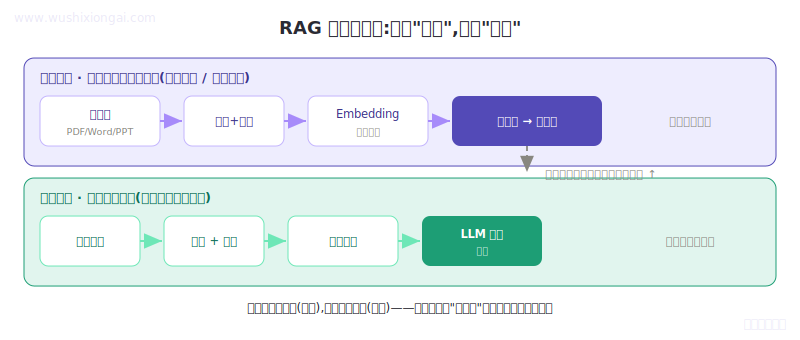

<div align="center">

# RAG From Zero

**从零做出能上线的 RAG 系统,跟着代码学,完整开源**

A complete, runnable, Chinese RAG tutorial — built by hand, no LangChain magic.

[](https://github.com/MisterBooo/rag-from-zero)
[](https://github.com/MisterBooo/rag-from-zero/fork)
[](https://www.wushixiongai.com/projects/rag-system)
[](LICENSE)
[](https://www.wushixiongai.com/projects/rag-system)

🌐 [在网站看完整教程](https://www.wushixiongai.com/projects/rag-system) ·
💻 [章节速览](#-章节速览) ·
⚡ [5 分钟跑起来](#-5-分钟跑起来) ·
📱 [关于作者](#关于作者) · ⭐ Star 一下支持

<br/>



<em>一套 RAG 系统的完整架构:离线建库 + 在线问答 双链路</em>

</div>

---

## 这个项目是什么

我是 [@MisterBooo](https://github.com/MisterBooo)，5 年前我做了 [LeetCodeAnimation](https://github.com/MisterBooo/LeetCodeAnimation)（用动画讲算法）。

2026 年，我把同样的「图解 + 实战」方法用在大模型上，做了这个 RAG 教程项目：**10 章 + 附录，每章配可运行代码、原创图解和大厂面试题，外加一个完整的端到端项目。**

### 给谁看?

**有编程基础（Python 会写、命令行能用）、但 RAG / Agent / 大模型应用零基础**的工程师。

- ❌ 不适合：完全不会编程的初学者
- ❌ 不适合:已经做过 RAG 项目的资深工程师
- ✅ 适合:**想转大模型岗、但被市面上「原理太抽象 / 代码太黑盒」的教程劝退的工程师**

### 跟市面上其他 RAG 教程有啥不一样?

| 维度 | 市面常见 RAG 教程 | 这个项目 |
|------|----------------|---------|
| 实现方式 | LangChain 封装,跑通了不知道为啥 | **全手写**,自己实现切分 / 检索 / 重排 / Query 改写 |
| 配套代码 | demo 玩具,clone 下来跑不通 | **完整可运行**,自带合成测试数据 |
| 内容深度 | 偏概念,缺真实工程经验 | **每章配真实项目踩坑**(核辐射条款、推销 vs 销售…) |
| 面试帮助 | 学完不知道怎么讲 | **每章配 5 道大厂真题** + 简历段位写法 |
| 目标读者 | 含糊不清 | **明确「半小白」**:有编程基础 + RAG 零基础 |

---

## ⚡ 5 分钟跑起来

> 需要 **Python 3.10+** 和 git。下面命令在 **macOS / Linux** 上用 `python3` / `pip3`,
> 在 **Windows** 上用 `python` / `pip`(或 `py -3`)。
> 跑不通?跳到下面的 [🐛 跑不通?常见问题](#-跑不通常见问题),或看 [TROUBLESHOOTING.md](TROUBLESHOOTING.md)。

### 30 秒:先看一个真实事故(零配置,不用 key)

```bash
git clone https://github.com/MisterBooo/rag-from-zero.git
cd rag-from-zero/chapters/ch03-chunking

# 装依赖(macOS / Linux)
pip3 install -r requirements.txt
# Windows: pip install -r requirements.txt

# 跑事故复现(macOS / Linux)
python3 reproduce-disaster.py
# Windows: python reproduce-disaster.py
```

你会看到(这是真实生产事故的最小复现,输出是确定的):

```
=== 固定长度切分的事故现场 ===

Chunk 0: 本保险承保意外伤害导致的身故或残疾,但以下情况除外

Chunk 1: :(1)战争 (2)核辐射

=== 用户问:核辐射在保障范围内吗? ===
→ Chunk 0 只到'但以下情况除外'就断了,除外项全在 Chunk 1
→ 检索只命中 Chunk 0,模型看不到核辐射属于除外项
→ 模型理直气壮回答'在保障范围内' → 真实场景:理赔差点出大事
```

**这就是你将跟着学的真实工程问题** —— 不是 toy demo。一刀切坏了一句话,线上就出了理赔事故。

### 完整版:跑通一个真正的 RAG 系统

[`rag_project/`](rag_project/) 是一个真正能跑的端到端系统:**DeepSeek + ChromaDB + bge-m3,核心代码全手写、没有 LangChain**,每个模块对应教程一章。

```bash
cd rag-from-zero/rag_project
# 下面用 macOS / Linux 的 python3 / pip3;Windows 换成 python / pip(或 py -3)

# 先跑零依赖冒烟测试,确认逻辑没问题(不需要 key、不下模型)
python3 tests/smoke_test.py

# 完整链路:造数据 → 建向量库 → 提问(需 DeepSeek key + 本地 Embedding)
pip3 install -r requirements.txt
cp .env.example .env            # 填入 DEEPSEEK_API_KEY
python3 scripts/generate_synthetic_data.py
python3 scripts/build_index.py
python3 scripts/ask.py "核辐射在保障范围内吗?"
```

`ask.py` 会打印「提问 → 答案 → 来源」,答案基于检索到的真实条款生成并标注出处。详细路径(含「30 秒免建库快速体验」)见 **[rag_project/README.md](rag_project/README.md)**。

### 🐛 跑不通?常见问题

**`zsh: command not found: pip` / `python`** —— 你多半在 macOS 上,系统命令是 `pip3` / `python3`(不是 `pip` / `python`)。直接用上面的 macOS / Linux 命令即可。

**`SSL: CERTIFICATE_VERIFY_FAILED`** —— 你装的是 python.org 官方安装包,默认没装 CA 证书。在终端跑一次(把 `3.13` 换成你的实际版本):

```bash
/Applications/Python\ 3.13/Install\ Certificates.command
```

装完再重新 `pip3 install`。

**pypi 太慢 / 卡住** —— 换清华镜像:

```bash
pip3 install -r requirements.txt -i https://pypi.tuna.tsinghua.edu.cn/simple
```

更全的排查(含 Windows / Linux)见 **[TROUBLESHOOTING.md](TROUBLESHOOTING.md)**。

---

## 📊 项目特色

### 🎯 目标读者锁死「半小白」

每章都用一套「铁律」控制质量,确保有编程基础、RAG 零基础的人能独立跟下来:

- 术语第一次出现,必有白话解释(「Embedding 就是把一段文字变成一串数字,意思相近的数字也相近」)
- 代码逐行注释,每段后写「你应该看到 XXX」
- 必有「🐛 跑不通?看这里」段,列常见报错
- 必有「🛠️ 动手实验」让你改一个参数、观察结果变化
- 每节结尾有「你掌握了什么」+「你做的 = 真实系统的哪一步」

### 📖 三段式结构,一章服务三种读者

每章约 8000–10000 字 + 多张原创图解,按 60 / 30 / 10 拆成三段:

| 段落 | 给谁看 | 占比 | 内容 |
|------|--------|:---:|------|
| 🚀 Part 1 · 主线实战 | 零基础,想先跑起来 | ~60% | 概念白话 + 代码逐行注释 |
| 🎯 Part 2 · 面试深度 | 想讲透、备战面试 | ~30% | 硬伤剖析 + 选型 + 业内行话 |
| 🏆 Part 3 · 验收串题 | 检验学到位没 | ~10% | 关联面试题 + 自检清单 |

想先跑起来只看 Part 1;备面试直奔 Part 2。

### 💻 全手写,不用 LangChain

LangChain 把一切都封装好了,**结果是你跑通了,却不知道里面发生了什么**。这套代码全部手写:

- 自己实现 PDF 解析 + 结构感知切分(第 3 章)
- 自己实现 Embedding + 向量库封装(第 4 章)
- 自己手写 BM25 + 向量混合检索(第 5 章)
- 自己实现 Cross-Encoder 重排(第 6 章)
- 自己实现 Query 理解与改写(第 7 章)

**学完是真懂 RAG,而不是只会调 LangChain 的几个 API** —— 这恰恰是面试官想确认的。

### 🐛 真实项目踩坑合集

每章都有 1–2 个真实保险项目踩坑案例 —— 面试时这些就是你的「故事素材」:

- **第 1 章** · 没用 RAG 直接问大模型 → 模型「编造」了一套现金价值公式,差点信了
- **第 3 章** · 固定长度切分 → 「核辐射条款」被切散,系统答「在保障范围内」,差点理赔事故
- **第 3 章** · OCR 印章遮挡 → 「理赔限额 100 万」被读成 10 万
- **第 5 章** · 用户问「推销」→ 文档里写的是「销售」,关键词检索召回为 0
- **第 5 章** · 录播视频检索为 0 → 视频内容根本不在向量库里,只有文件名

[在网站读完整事故复盘 →](https://www.wushixiongai.com/projects/rag-system)

---

## 📚 章节速览

| # | 主题 | 你将学到 / 真实事故 | 代码 | 文章 |
|---|------|---------------------|:---:|:---:|
| 1 | 为什么做 RAG | 「现金价值公式被编」事故;20 行迷你 RAG 跑通核心机制 | [→](chapters/ch01-why-rag/) | [→](https://www.wushixiongai.com/projects/rag-system/c/01-why-rag) |
| 2 | RAG 整体架构 | 四大模块怎么联动;为什么大模型反而最省心 | [→](chapters/ch02-architecture/) | [→](https://www.wushixiongai.com/projects/rag-system/c/02-architecture) |
| 3 | 文档预处理与切分 | 「核辐射条款被切散」事故;召回率从 67% 提到 91% | [→](chapters/ch03-chunking/) | [→](https://www.wushixiongai.com/projects/rag-system/c/03-chunking) |
| 4 | Embedding 选型 | bge-m3 / OpenAI / 国产模型怎么选;何时该微调 | [→](chapters/ch04-embedding/) | [→](https://www.wushixiongai.com/projects/rag-system/c/04-embedding) |
| 5 | 检索召回 · 混合检索 | 「推销 vs 销售召回为 0」事故;手写 BM25 + 向量融合 | [→](chapters/ch05-retrieval/) | [→](https://www.wushixiongai.com/projects/rag-system/c/05-retrieval) |
| 6 | 重排与检索优化 | Cross-Encoder 凭什么更准;精排慢了怎么提速 | [→](chapters/ch06-reranking/) | [→](https://www.wushixiongai.com/projects/rag-system/c/06-reranking) |
| 7 | Query 理解与改写 | HYDE「先让模型瞎答一个」为什么反而提升召回 | [→](chapters/ch07-query-understanding/) | [→](https://www.wushixiongai.com/projects/rag-system/c/07-query-understanding) |
| 8 | 多轮对话与记忆 | 把「那它过了还能退吗」里的「它」补全成可检索的问题 | [→](chapters/ch08-memory/) | [→](https://www.wushixiongai.com/projects/rag-system/c/08-memory) |
| 9 | 上下文问答与引用溯源 | 基于资料生成、没依据就拒答、每个结论标出处 | [→](chapters/ch09-citation/) | [→](https://www.wushixiongai.com/projects/rag-system/c/09-citation) |
| 10 | 系统评估与上线优化 | 「没有评估集的优化都是自嗨」;Recall@k / MRR | [→](chapters/ch10-evaluation/) | [→](https://www.wushixiongai.com/projects/rag-system/c/10-evaluation) |
| 附录 | 写进简历 & 面试应答 | 简历填空模板 + STAR 话术 | [→](chapters/appendix-resume-interview/) | [→](https://www.wushixiongai.com/projects/rag-system/c/appendix-resume-interview) |

---

## 🗂️ 项目结构

```
rag-from-zero/
├── README.md                       ← 你正在看的文件
├── LICENSE                         ← MIT
├── chapters/                       ← 每章一个目录:可运行 demo + 章节说明
│   ├── ch01-why-rag/               # 第 1 章 · 为什么做 RAG
│   ├── ch02-architecture/          # 第 2 章 · RAG 整体架构
│   ├── ch03-chunking/              # 第 3 章 · 文档切分(含「核辐射事故」复现)
│   │   ├── chunk_demo.py           #   跟着敲的切分 demo
│   │   ├── reproduce-disaster.py   #   复现「核辐射条款被切散」
│   │   ├── requirements.txt
│   │   └── sample-data/            #   合成保险条款
│   ├── ch04-embedding/  …  ch10-evaluation/
│   └── appendix-resume-interview/  ← 简历填空模板
└── rag_project/                    ← 完整端到端项目(DeepSeek + ChromaDB,手写无 LangChain)
    ├── src/                        ← 核心模块,各对应一章(loader / chunker / embedder /
    │                                  vectorstore / retriever / reranker / query_processor /
    │                                  generator / pipeline)
    ├── scripts/                    ← 造数据 / 建库 / 问答(generate / build_index / ask / quickstart)
    └── tests/                      ← 零依赖冒烟测试 + 评估集
```

**每章自包含** —— `cd chapters/ch03-chunking && pip3 install -r requirements.txt && python3 chunk_demo.py` 就能跑(Windows 用 `pip` / `python`)。

---

## 📈 学完能做什么

### 简历可以怎么写

完整 3 种段位写法见 → [项目案例库 · RAG 智能问答系统](https://www.wushixiongai.com/projects/rag-system)。节选高级段位:

> **保险智能客服 RAG 系统**(技术负责人 / 团队 5 人)
>
> - 主导某保险公司客服 RAG 系统,处理 5000+ 真实文档
> - 设计 **结构感知切分 + 向量 + BM25 混合检索** 两阶段架构
> - 通过三代切分策略迭代,**召回率 67% → 91%**(+24pp,QA 评估集 200 题)
> - 引入 Cross-Encoder 精排,Top-5 准确率 +23pp
> - 解决 5 类生产问题:核辐射条款切散、术语同义词、OCR 印章遮挡…

### 面试可以怎么讲

每章末尾配 5 道大厂真题（共 50 道），按「为什么这么设计 / 踩过什么坑 / 怎么解决」的思路给讲法。

更多 → [大模型面试题库](https://www.wushixiongai.com/questions)

---

## 关于作者

- 📚 [LeetCodeAnimation](https://github.com/MisterBooo/LeetCodeAnimation) —— 用动画讲算法
- 🌐 [wushixiongai.com](https://www.wushixiongai.com) —— 大模型面试题库
- 📱 公众号 **「吴师兄学大模型」** —— 给想进大厂大模型岗的工程师：每天一题 + 项目拆解

---

## 📜 项目来源

这个项目来自训练营 **2025 年的真实付费项目**,公开版面向自学:文章、可运行代码、图解和配套面试题都在这里,数据做了脱敏(用合成保险条款代替真实业务数据)。1v1 答疑、面试模拟、简历批改等服务,保留在训练营。

想了解训练营,可以关注公众号「吴师兄学大模型」。

---

## Star History

[](https://star-history.com/#MisterBooo/rag-from-zero&Date)

---

## License

MIT —— 自由使用,商用请保留署名。

---

⭐ 如果对你有帮助,**给个 Star** 就是对我最大的支持。

❓ 有问题?欢迎提 [Issue](https://github.com/MisterBooo/rag-from-zero/issues) 或在公众号留言。

<sub>ℹ️ 本仓库由主仓库自动同步生成(源目录 <code>docs/v2-rag-project/github-repo/</code>,push 到 <code>production</code> 时通过 rsync 同步)。**请勿直接在本仓库修改**,会被下次同步覆盖。</sub>
